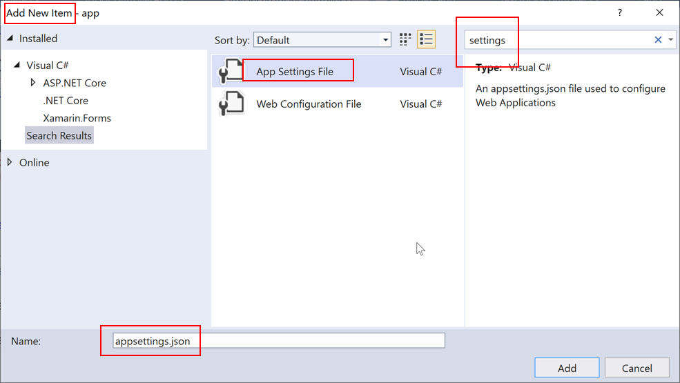

# ASP.NET Core Configuration

Configuration Parameters for ASP.NET Core Apps


<!-- .slide: class="left" -->
## Security Advice

**Strict separation of config from code**

* **Never** store passwords or other sensitive data in code or in plain text configuration files
* **Don't** use production secrets in development or test environments
* Specify secrets **outside** of the project so that they can't be accidentally committed to a source code repository
* In practice (out-of-scope for this course):
  * Use [guidelines for safe storage of app secrets in ASP.NET Core](https://docs.microsoft.com/en-us/aspnet/core/security/app-secrets)
  * Use a hardware-protected key store like [*Azure Key Vault*](https://azure.microsoft.com/services/key-vault/)


<!-- .slide: class="left" -->
## Configuration Settings




<!-- .slide: class="left" -->
## Configuration Settings

* Configuration file *appsettings.json*
* Reference nested settings in C# with *:* or sometimes *__*
  * E.g. `DemoOption:DemoSettingString`
* Override settings with environment variables
  * E.g. `set DemoOption__DemoSettingString=10`

```
<!--#include file="aspnet-core/0030-web-api/app/appsettings.json" -->
```


<!-- .slide: class="left" -->
## Configuration Settings

```
<!--#include file="aspnet-core/0030-web-api/app/AdvancedToDoControllerCtor.cs" -->
```


<!-- .slide: class="left" -->
## Options

* Practical tip for more complex applications, out-of-scope for this course
* For group of related settings
* Type-safe access to settings
* [*Options pattern* in documentation](https://docs.microsoft.com/en-us/aspnet/core/fundamentals/configuration/options)


<!-- .slide: class="left" -->
## Production Override

* Store development settings in *appsettings.json*
* Override settings in production...
  * ...with [command-line parameters](https://docs.microsoft.com/en-us/aspnet/core/fundamentals/configuration/#command-line-configuration-provider) (e.g. `dotnet run mysetting=myvalue`)
  * ... with [environment variables](https://docs.microsoft.com/en-us/aspnet/core/fundamentals/configuration/#environment-variables-configuration-provider)
