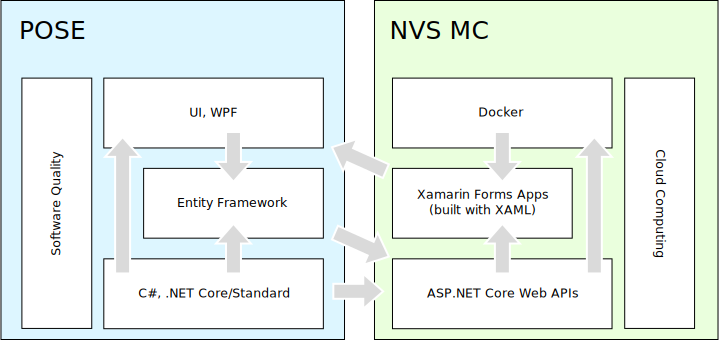

# Course Content

What will you learn in this year's courses?

## Content

<!-- .slide: class="left" -->
## General Goals

* Build on a common platform (C#, .NET Core) to minimize required learning
* Gain knowledge that is applicable *today*
  * We can look into new, cool stuff that is coming in lightning talks
* Focus on cross-platform development
  * Make knowledge broadly usable
* Focus on open-source platforms
* Use latest versions (e.g. .NET Core 3, VS 2019), minimize old stuff
* Gain knowledge that is valuable on the job market

<!-- .slide: class="left" -->
## POSE: CSharp, .NET Core/Standard

* Recap C#
* Deep dive into more advanced C# concepts
* Cross-platform .NET Core development
* Library development with .NET Standard

<!-- .slide: class="left" -->
## NVS MC: ASP.NET Core Web APIs

* Practical application of C#/.NET Core (POSE)
* .NET Core Web APIs as the backend for mobile apps
* Open API

<!-- .slide: class="left" -->
## POSE: Entity Framework

* Learn how to access databases with OR Mapper
* Practical application of C#/.NET Core (POSE)
* Integrate Entity Framework in Web APIs (NVS MC)

<!-- .slide: class="left" -->
## NVS MC: Xamarin Forms, XAML

* XAML UI declaration language
* Practical use of XAML in cross-platform mobile apps with Xamarin Forms
* Integrate XAML with C# code (POSE)
* Use backend Web APIs (NVS MC)

<!-- .slide: class="left" -->
## POSE: UI, WPF

* Second practical application of XAML (NVS MC) as a UI declaration language
* Designing and implementing UIs
* Use backend Web APIs (NVS MC)
* Use Entity Framework (POSE)

<!-- .slide: class="left" -->
## NVS MC: Docker

* Host Web APIs (NVS MC) in Docker containers
* Cross-platform cloud computing
* Practical application of cross-platform .NET Core development (POSE)
* Backend for mobile apps (NVS MC)

<!-- .slide: class="left" -->
## POSE: Software Quality

* Automated testing of C#/.NET Core apps (POSE)
* Use mocking for testing database logic (Entity Framework, POSE)
* Build/test automation with Docker (NVS MC)

<!-- .slide: class="left" -->
## NVS MC: Cloud Computing

* Cloud Computing principals
* Practical use of Docker (NVS MC) in public clouds
* Host backend Web APIs (NVS MC) for mobile apps in public cloud
* Practical application of test automation (POSE) in the Azure cloud
