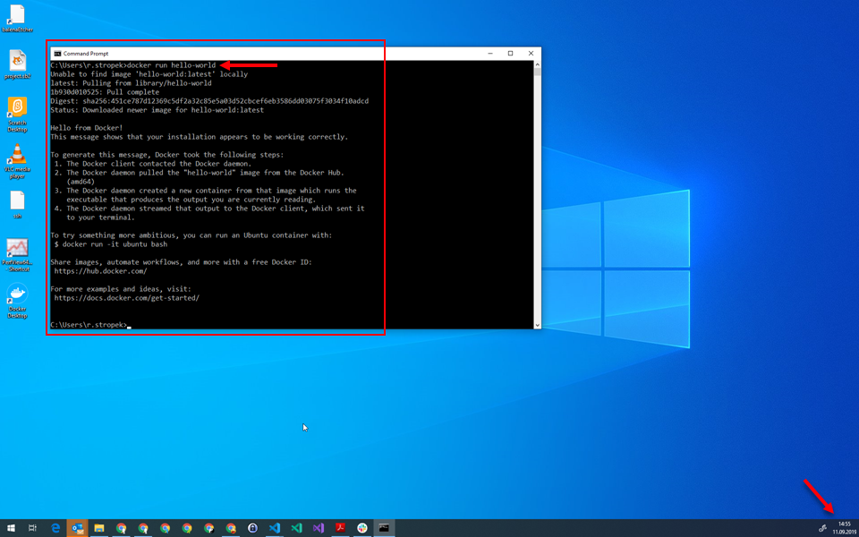

# Setup Technical Prerequisites

## Introduction

In this exercise, you have to setup the necessary prerequisites for this course.

## Homework

**You have to hand-in two screenshots via mail** to prove that you have done this homework (screenshot has to show the entire desktop including date and time in *Windows Taskbar*):

1. Screenshot of the Xamarin Forms mobile demo app mentioned below.
1. Screenshot of the output of the Docker `hello-world` container mentioned below.
1. Screenshot of the output of a `docker images` command after you will have pulled the Docker images mentioned below.
1. You account name for *dockerhub*
1. Your account name for *Azure DevOps* and *Visual Studio App Center*

Here is an example for a screenshot (Docker output):

If you cannot setup your development environment because of technical problem, you have to send a detailed problem description including:

1. Relevant error messages and/or screenshots showing the error
1. List of things you did to solve the problem (including links to e.g. blog posts you followed)

Of course you can combine all outputs in a single screenshot if you want.

### Hyper-V

It is strongly recommended to use *Hyper-V* on Windows 10. [Here](https://docs.microsoft.com/en-us/virtualization/hyper-v-on-windows/quick-start/enable-hyper-v#enable-the-hyper-v-role-through-settings) you can find a description for how to enable it.

Note that it is *not* possible to run Hyper-V and other virtualizers like *VMWare* at the same time on the same device. If you absolutely need VMWare and/or you cannot activate Hyper-V, you can of course still work in this course. However, setup will be more difficult and building and debugging apps will not be as convenient.

An option for those of you who cannot change their existing Windows configuration, [*Boot to VHD (Native Boot)*](https://docs.microsoft.com/en-us/windows-hardware/manufacture/desktop/boot-to-vhd--native-boot--add-a-virtual-hard-disk-to-the-boot-menu) might be an option.

### Mobile Development

#### Why Xamarin

In this course, we will use *Xamarin* to build cross-platform mobile apps. Using this platform has a lot of advantages. Examples:

* *Xamarin* is programmed using C#. Therefore, we have a lot of synergy effects with your C# course and you do not have to learn a new language (which you would if we would use e.g. *Flutter*).
* With *Xamarin*, you can generate Android and iOS apps. Therefore, everyone can test apps on her own device, independent of whether you use Android or iPhones.

#### Visual Studio

In this course, you will need the *Community* edition of *Visual Studio*. You can download it [here](https://visualstudio.microsoft.com/vs/community/). This edition is free for academic purposes.

When installing Visual Studio, make sure to install the following workloads:

1. *.NET Core cross-platform development*
1. *ASP.NET and web development*
1. *.NET desktop development*
1. *Azure development*
1. *Mobile Development with .NET*

Additionally, install the preview version of the [*.NET Core 3.0 SDK*](https://dotnet.microsoft.com/download/dotnet-core).

#### Emulator

In order to test your Xamarin apps on Windows, you need an Android emulator. As most of you use Windows, the best option is using the [*hardware acceleration for emulator performance (Hyper-V & HAXM)*](https://docs.microsoft.com/en-us/xamarin/android/get-started/installation/android-emulator/hardware-acceleration?tabs=vswin&pivots=windows). Follow this installation guide to configure your development environment accordingly.

If you cannot use Hyper-V, you can use the Android emulator without hardware acceleration, too. However, the performance might be very bad.

If you cannot or do not want to use the emulator, you can also do on-device debugging. [Here](https://developer.android.com/studio/debug/dev-options#enable) you can find a description for how to enable debugging on Android.

#### Test Your Setup

If you want to check whether your development environment works fine, work through the [Xamarin Forms First App Tutorial](https://docs.microsoft.com/en-us/xamarin/get-started/first-app/?pivots=windows). Note that building and testing Android apps is sufficient for this course.

#### Azure DevOps

Get a *free* account for [*Azure DevOps*](https://azure.microsoft.com/en-us/pricing/details/devops/azure-devops-services/).

#### App Center

Get a *free* account on [*App Center*](https://visualstudio.microsoft.com/app-center/pricing/).

### Docker

#### Why Docker

There are many different cloud providers on the market. By far the largest ones are Microsoft, Amazon, and Google. Because of limited time, we cannot cover all three of them. Therefore, we will focus on *Docker*. This technology is available on all major public clouds and can be used on-premises, too.

#### Docker Desktop

The easiest way to setup Docker is to install [Docker Desktop](https://docs.docker.com/docker-for-windows/install/).

If you cannot or do not want to use Docker Desktop, you can try [Docker Machine](https://docs.docker.com/machine/overview/). Note that this product is superseded. However, if you e.g. cannot use Hyper-V on your computer, Docker Machine might still be useful.

If you cannot use Docker Machine or Docker Desktop, you can manually setup a virtual machine with Linux and [install *Docker CE*](https://docs.docker.com/install/linux/docker-ce/ubuntu/) manually. Please note that this option requires a much more deeper understanding of Docker. Therefore, prefer Docker Desktop over manual Docker installation.

#### Test Your Setup

Test your development environment as follows:

* Check whether you can run Docker containers ([tutorial](https://docs.docker.com/docker-for-windows/#test-your-installation))
* Check whether you can access Docker from Visual Studio Code ([tutorial](https://code.visualstudio.com/docs/azure/docker#_docker-view))
* Check whether you can access Docker from Visual Studio ([tutorial](https://tutorials.visualstudio.com/aspnet-container/create))

#### Docker Hub Account

Create an account on [*dockerhub*](https://hub.docker.com/).

#### Docker Images

In the course, we will need some Docker images that are pretty big. I suggest running the following statements in an environment with good internet connection.

* `docker pull debian`
* `docker pull alpine`
* `docker pull mcr.microsoft.com/dotnet/core/sdk:2.2`
* `docker pull mcr.microsoft.com/dotnet/core/aspnet:2.2`
* `docker pull mcr.microsoft.com/dotnet/core/sdk:3.0`
* `docker pull mcr.microsoft.com/dotnet/core/aspnet:3.0`
* `docker pull mcr.microsoft.com/dotnet/core/sdk:2.2-alpine`
* `docker pull mcr.microsoft.com/dotnet/core/aspnet:2.2-alpine`
* `docker pull mcr.microsoft.com/dotnet/core/sdk:3.0-alpine`
* `docker pull mcr.microsoft.com/dotnet/core/aspnet:3.0-alpine`
* `docker pull nginx`
* `docker pull nginx:alpine`
* `docker pull mcr.microsoft.com/mssql/server`
