# Azure Deployment

Running ASP.NET Core Web APIs in the Cloud

<!-- .slide: class="left" -->
## Azure Benefits

* As students, you get free access to Azure
  * [Permanently free offerings](https://docs.microsoft.com/en-us/azure/billing/billing-create-free-services-included-free-account)
  * 100USD credit for commercial offerings
  * [FAQ](https://azure.microsoft.com/en-us/free/free-account-students-faq/)
* Works with your Office 365 accounts from HTL Perg
* Step-by-step description for signup and deployment of ASP.NET Web API see following slides

<!-- .slide: class="left" -->
## Sign In

* Open a browser window in which you are logged in with your Office 365 account
  * Verify that you are logged in by e.g.[checking your emails](https://outlook.office.com/mail/)
* Open [Azure portal](https://portal.azure.com)
* Navigate to *Resource Groups*

<!-- .slide: class="left" -->
## Sign In

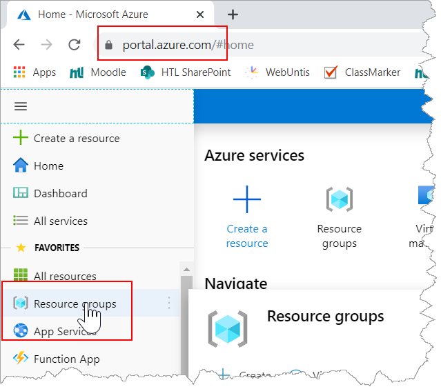

<!-- .slide: class="left" -->
## Get Azure Student Benefits

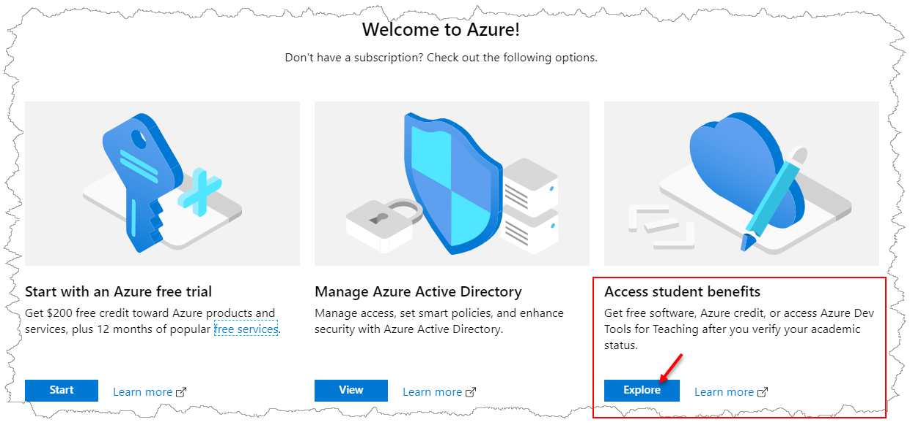

<!-- .slide: class="left" -->
## Get Azure Student Benefits

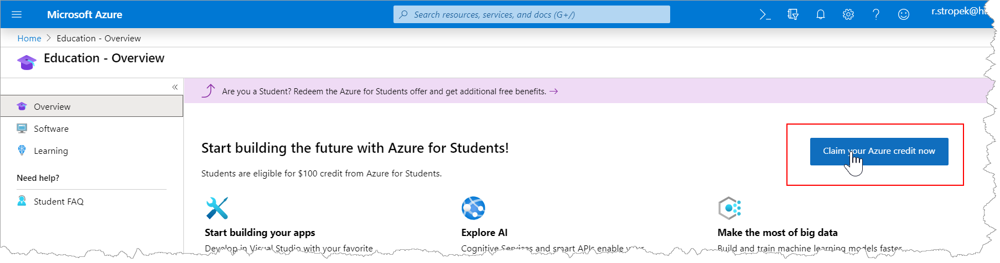

<!-- .slide: class="left" -->
## Get Azure Student Benefits

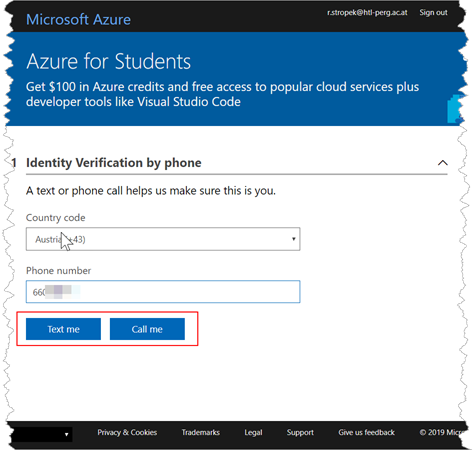

<!-- .slide: class="left" -->
## Get Azure Student Benefits

<!-- .slide: class="left" -->
## Get Azure Student Benefits

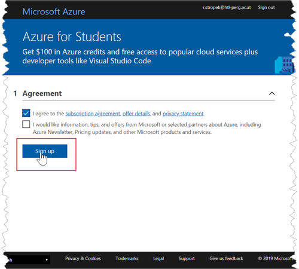

<!-- .slide: class="left" -->
## Get Azure Student Benefits

* After a few moments, you should have an active Azure subscription.
* Now we can deploy a Web API
  * Open [Azure portal](https://portal.azure.com)
  * Follow screenshots on the following slides

> Note that it should **not** be required to enter credit card information. If it is, do **not** enter any credit card data to make sure you do not have to pay Azure costs.

<!-- .slide: class="left" -->
## Deploy Web API

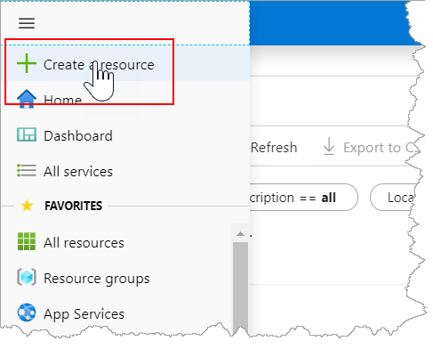

<!-- .slide: class="left" -->
## Deploy Web API

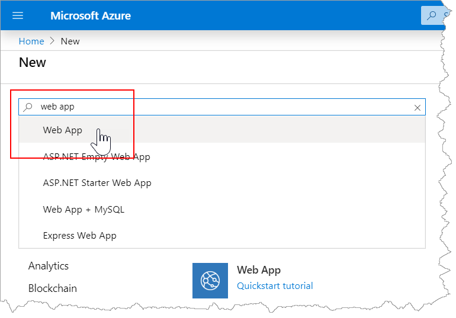

<!-- .slide: class="left" -->
## Deploy Web API

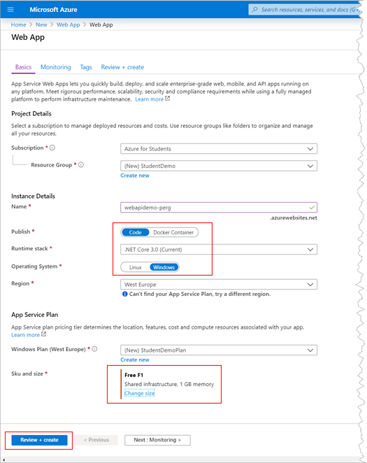

<!-- .slide: class="left" -->
## Deploy Web API

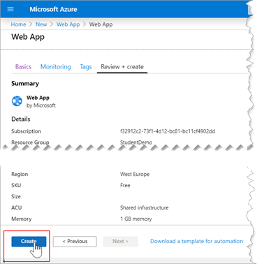

<!-- .slide: class="left" -->
## Deploy Web API

* Now we have an environment in Azure in which we can deploy our Web API
* Open Visual Studio 2019
  * Sign in with your school account
  * It is ok to have multiple accounts, Visual Studio allows you to log in with multiple accounts
  * Follow screenshots on the following slides

<!-- .slide: class="left" -->
## Deploy Web API

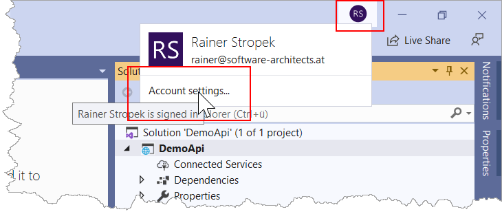

<!-- .slide: class="left" -->
## Deploy Web API

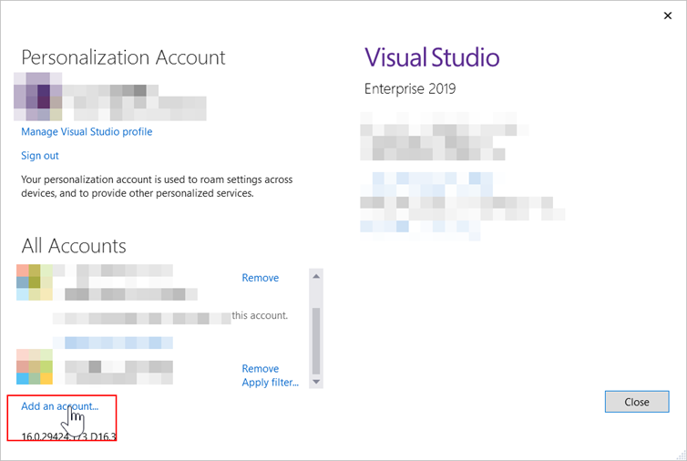

<!-- .slide: class="left" -->
## Deploy Web API

* Now you will have to log in with your school account
* After successful login, you should see your account in Visual Studio
  * Follow screenshots on the following slides

<!-- .slide: class="left" -->
## Deploy Web API

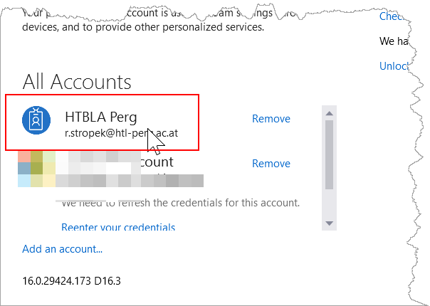

<!-- .slide: class="left" -->
## Deploy Web API

* Create an ASP.NET Core 3 Web API project or open an existing one
* We will deploy the Web API from Visual Studio
* *Friends don't let friends deploy from Visual Studio* &#128521;
  * Note that professional users don't do that in real life
  * They use [Azure Pipelines](https://azure.microsoft.com/en-us/services/devops/pipelines/) instead

<!-- .slide: class="left" -->
## Deploy Web API

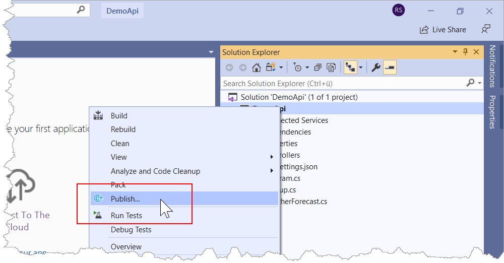

<!-- .slide: class="left" -->
## Deploy Web API

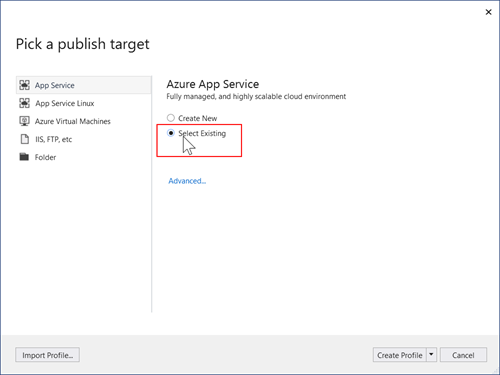

<!-- .slide: class="left" -->
## Deploy Web API

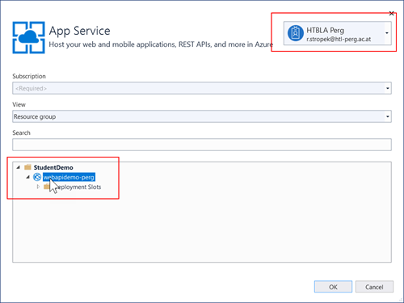

<small>You might need to sign in again in this step</small>

<!-- .slide: class="left" -->
## Deploy Web API

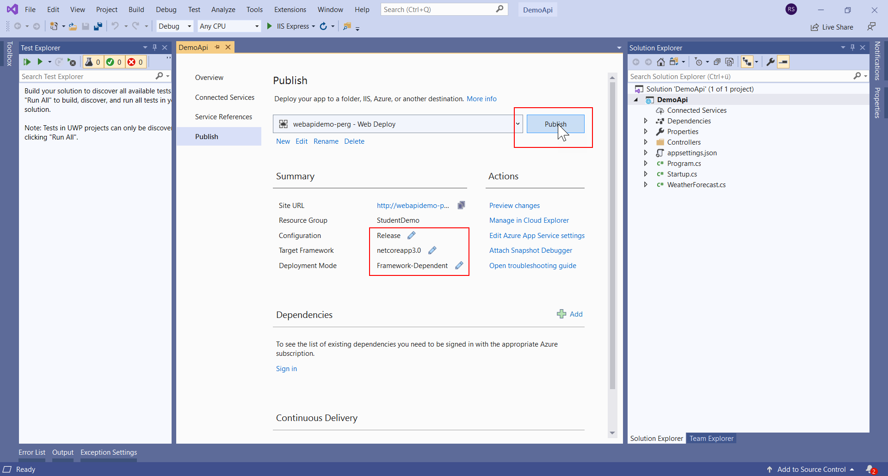

<!-- .slide: class="left" -->
## Deploy Web API

Our Web API is available in Azure &#128512;

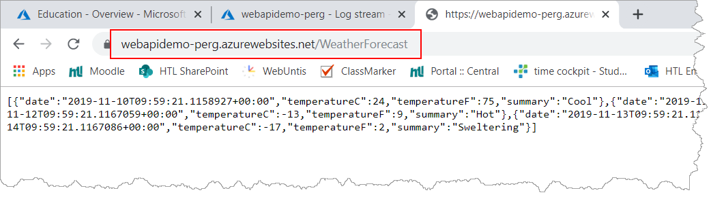
