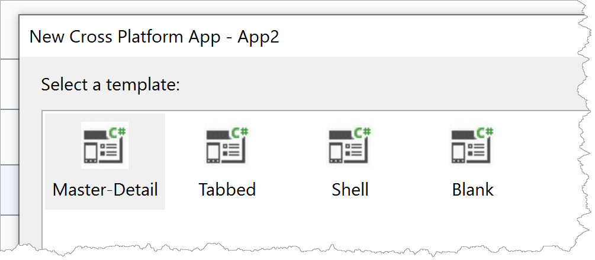

# Xamarin

Develop Native Mobile Apps with Portable C# Code


<!-- .slide: class="left" -->
## Xamarin

* Open Source platform for mobile development
  * [GitHub](https://github.com/xamarin)
* Uses C# and .NET Core
* Write logic once, compile it to native apps for different platforms
  * Platform-specific code pieces are possible (and often necessary)
* Resources:
  * [Landing page](https://dotnet.microsoft.com/apps/xamarin)
  * [Xamarin tutorial](https://dotnet.microsoft.com/learn/xamarin/hello-world-tutorial/intro)
  * [Xamarin docs](https://docs.microsoft.com/en-us/xamarin/get-started/)


<!-- .slide: class="left" -->
## Xamarin Forms

* Built on top of Xamarin
* Reuse not only logic, but also view
* Uses [XAML](https://docs.microsoft.com/en-us/xamarin/xamarin-forms/xaml/)
  * *eXtensible Application Markup Language*
* Xamarin Forms' XAML is very similar to WPF's XAML
  * Reuse existing knowledge
* Resources:
  * [Xamarin Forms docs](https://docs.microsoft.com/en-us/xamarin/xamarin-forms/)
  * [GitHub](https://github.com/xamarin/Xamarin.Forms)
  * [Exercise: Installing Prerequisites](course-org/0010-prerequisites)


<!-- .slide: class="left" -->
## Structure of Xamarin Forms Project

* Multiple projects
  * One project for each platform (Xamarin, iOS)
  * One project with portable code (Xamarin Forms)
  * In this course, we will focus on portable code because of time constraints
* `App` class
  * Sets initial main page of app (`MainPage` property)
  * Persistent `Properties` dictionary ([docs](https://docs.microsoft.com/en-us/xamarin/xamarin-forms/app-fundamentals/application-class#Properties_Dictionary))
  * Handler functions for [lifecycle events](https://docs.microsoft.com/en-us/xamarin/xamarin-forms/app-fundamentals/app-lifecycle)
  * Read more about [Android Activity Lifecycle](https://developer.android.com/guide/components/activities/activity-lifecycle)
  * [Docs](https://docs.microsoft.com/en-us/xamarin/xamarin-forms/app-fundamentals/application-class)


<!-- .slide: class="left" -->
## Example for `Properties` Dictionary

```csharp
public MainPage()
{
    InitializeComponent();
    if (Application.Current.Properties.TryGetValue("LastChoice", out var propValue))
    {
        LastChoice = propValue.ToString();
    }

    BindingContext = this;
}

private async void OnFormPage(object sender, EventArgs e)
{
    Application.Current.Properties["LastChoice"] = LastChoice = "Form Page";
    await Application.Current.SavePropertiesAsync();
    await Navigation.PushModalAsync(new NavigationPage(new FormPage()));
}
```


<!-- .slide: class="left" -->
## Xamarin Forms User Interface

* Many built-in controls available ([docs](https://docs.microsoft.com/en-us/xamarin/xamarin-forms/user-interface/))
* [Controls Reference](https://docs.microsoft.com/en-us/xamarin/xamarin-forms/user-interface/controls/)
  * Make yourself familiar with [Pages, Layouts, Views, and Cells](https://docs.microsoft.com/en-us/xamarin/xamarin-forms/user-interface/controls/)
* **Tip:** Use Visual Studio to create samples apps and explore the code




<!-- .slide: class="left" -->
## Data Binding Basics

* Bind UI on properties/functions in C#
  * Similar to Angular Data Binding (e.g. `{{ boundProperty }}` or `[(ngModel)]="boundProperty"`)
* Xamarin Forms [Data Binding docs](https://docs.microsoft.com/en-us/xamarin/xamarin-forms/app-fundamentals/data-binding/)
* Set the [`BindingContext`](https://docs.microsoft.com/en-us/dotnet/api/xamarin.forms.bindableobject.bindingcontext?view=xamarin-forms#Xamarin_Forms_BindableObject_BindingContext) to the source object to which you would like to bind
  * Note: In WPF, this property is called [`DataContext`](https://docs.microsoft.com/en-us/dotnet/api/system.windows.frameworkelement.datacontext?view=netcore-3.0)
* Use `{Binding Path=MyProperty}` for binding


<!-- .slide: class="left" -->
## Data Binding Basics

```csharp
public FormPage()
{
    InitializeComponent();
    BindingContext = new Customer() { FirstName = "Foo", ... };
}
```

```xml
<ContentPage.Content>
    <StackLayout Spacing="20" Padding="15">
        <Label Text="First Name" />
        <Entry Text="{Binding Path=FirstName}" />
        ...
    </StackLayout>
</ContentPage.Content>
```


<!-- .slide: class="left" -->
## Data Binding Basics

* In order to update the UI automatically, binding source object must implement [`INotifyPropertyChanged`](https://docs.microsoft.com/en-us/dotnet/api/system.componentmodel.inotifypropertychanged)

```csharp
public class Customer : INotifyPropertyChanged
{
    private string FirstNameValue = "Foo";
    public string FirstName
    {
        get => FirstNameValue;
        set
        {
            FirstNameValue = value;
            OnPropertyChanged(nameof(FirstName));
        }
    }

    private void OnPropertyChanged(string propertyName) =>
        PropertyChanged?.Invoke(this, new PropertyChangedEventArgs(propertyName));

    public event PropertyChangedEventHandler PropertyChanged;
}
```


<!-- .slide: class="left" -->
## Data Binding Basics

* Always use [`ObservableCollection<T>`](https://docs.microsoft.com/en-us/dotnet/api/system.collections.objectmodel.observablecollection-1) with data binding
  * Avoid using other collection types like `List<T>`
  * Reason: Implements `INotifyCollectionChanged` for data binding

```csharp
public ObservableCollection<Customer> Customers { get; } = new ObservableCollection<Customer>
  {  new Customer { FirstName = "John", LastName = "Doe" }, ... };
```

```xml
<ListView ItemsSource="{Binding Path=Customers}" HasUnevenRows="True">
    <ListView.ItemTemplate>...</ListView.ItemTemplate>
</ListView>
```
